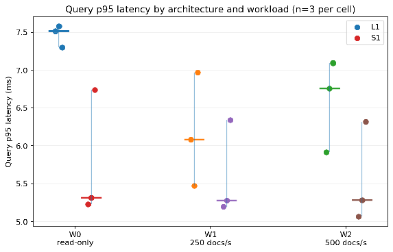
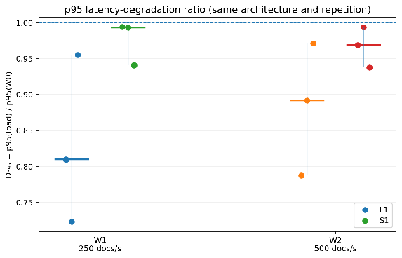
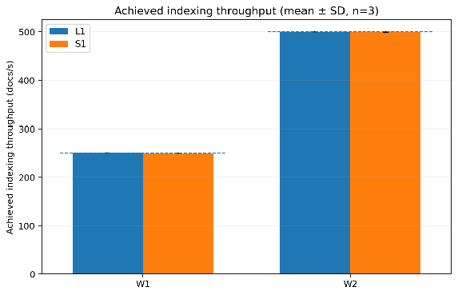
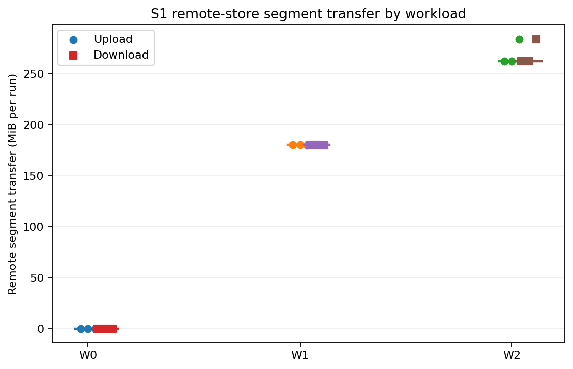
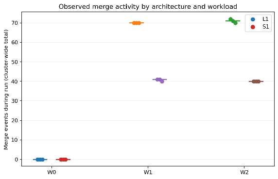
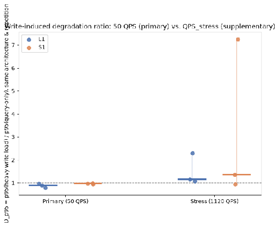
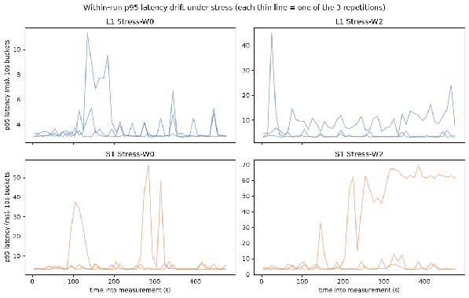

# Abstract {.unnumbered}

Retrieval systems commonly assign multiple tasks such as index construction, durable index storage, and query execution to the same nodes. Concurrent indexing can therefore interfere with query serving by competing for CPU, memory, storage bandwidth, and operating-system page cache. This thesis evaluates whether a Shared Index Architecture, in which such responsibilities are segregated among different nodes, provides stronger query-latency isolation than the classic Local Index Architecture.

A controlled benchmark compares the two architectures using OpenSearch 3.7.0, the same product corpus, the same fixed set of 5,000 product-search queries, one primary shard, equal per-node resource limits, and the same run procedure. Three steady-state workload conditions are evaluated at a constant 50 QPS: a read-only baseline, moderate indexing at 250 documents/s, and heavy indexing at 500 documents/s. The primary outcome is p95 query-latency degradation relative to each architecture's own read-only baseline; p50/p99 latency, achieved throughput, resource utilization, errors, and remote segment transfer provide supporting evidence.

All 18 formal runs completed successfully, with both architectures sustaining the offered workloads with no query or indexing errors. At 50 QPS, no mixed-workload repetition showed positive p95 degradation relative to its own read-only baseline. A supplementary 12-run stress evaluation at 1,120 QPS showed that this observation was conditional on workload intensity: concurrent indexing produced positive p95 degradation in multiple repetitions of both architectures.

However, the Shared Index Architecture did not exhibit consistently lower query-latency degradation and showed the largest observed tail-latency excursion. The results therefore do not support the hypothesis that Shared Index Architecture inherently provides stronger latency isolation, but indicate that write-read contention emerges closer to the query-capacity boundary.

**Keywords:** information retrieval, compute–storage separation, Lucene, OpenSearch, query latency, indexing, caching, distributed systems

# 1. Introduction
## 1.1 Context
Modern software systems increasingly depend on search engines to provide quick access to an ever growing and frequently-changing corpus of data. Search platforms such as Elasticsearch, OpenSearch, and Apache Solr are used in applications including e-commerce search, observability, AI-powered Retrieval Augmented Generation, analytics, and general knowledge discovery.

Many of these systems are built on Apache Lucene, a search library that organizes indexed data into segment-based index structures. Queries access these structures to retrieve matching documents, while indexing operations create new segments and periodically merge smaller segments into larger ones [@luceneIndexPackage; @luceneIndexWriter].

In conventional deployments, indexing, durable storage, segment management, and query execution are commonly performed by the same cluster nodes. This design provides a relatively simple operational model, but it can also create competition between read and write workloads [@liang2026writeRead; @opensearchIntro].

## 1.2 Problem Statement
Concurrent indexing can degrade query performance because indexing and query execution may compete for CPU time, memory, local storage and network bandwidth, and cache capacity [@liang2026writeRead].

Segment merge operations can read and rewrite substantial volumes of index data while queries simultaneously perform latency-sensitive access to index structures such as postings lists, term dictionaries, stored fields, and document values [@luceneIndexWriter; @luceneIndexPackage].

This interference may cause an increase in tail latency even when average query latency remains acceptable. Therefore, in production systems, p95 and p99 latency are often more informative than mean latency for understanding the slower requests that can affect service-level objectives [@dean2013tail].

This thesis refers to the performance impact of concurrent indexing on query serving as **write-read contention**.

## 1.3 Architectural Alternatives
Within the scope of this work, we will refer to two groups of architectures commonly used for retrieval systems in terms of access and ownership to indexed files–Local Index Architecture and Shared Index Architecture.

### Local Index Architecture
A Local Index Architecture is a retrieval architecture in which query-serving nodes maintain durable local copies of their assigned index partitions. Index construction, segment management, storage, and query execution may therefore share local node resources.

Typical characteristics of this architecture are:

- durable index files stored on local or claimed storage attached to a cluster node;  
- search nodes owning persistent shard copies;  
- indexing and query execution occurring within the same nodes;  
- fault tolerance through index replication;  
- recovery through shard assignment and data migration from existing nodes to new ones;  
- read scaling through additional index replication.

Conventional deployments of Elasticsearch, OpenSearch, and Apache Solr illustrate this architecture through locally maintained primary/replica shard copies and distributed query serving [@elasticNodeRoles; @opensearchIntro; @solrCloudShards].

### Shared Index Architecture
A Shared Index Architecture is a retrieval architecture in which durable index partitions reside in a storage layer independently accessible by multiple query nodes. Query nodes maintain only transient local state, such as caches and open index readers, while index construction and durable storage are managed separately.

Typical characteristics of this architecture are:

- immutable index segments stored in shared/remote object storage;  
- index construction performed by dedicated write nodes;  
- query nodes caching segments locally instead of owning durable index copies;  
- independent scaling of indexing and query capacity;  
- node recovery through restart and cache reconstruction.

Representative implementations and production designs include OpenSearch search replicas, Uber's separated search platform, Quickwit, and Yelp's nrtSearch [@opensearchSeparation; @song2025uberSearch; @quickwitArchitecture; @yelpNrtSearch].

## 1.4 Research Motivation
The compute–storage separation pattern—a core characteristic of the Shared Index Architecture—is increasingly used in cloud-native systems to decouple durable storage from serving compute and allow the two resource pools to scale independently, with different performance and cost trade-offs [@li2019cloudNative; @duwe2025fiveMinute].

For retrieval systems, the main expected benefit is stronger latency isolation during retrieval. If query nodes no longer perform index construction or segment merging, indexing workloads should have less direct impact on query latency. However, this separation introduces new trade-offs.

Query nodes may need to download segments from remote storage. Their performance may depend on cache state, query locality, segment size, segment churn, and network latency. Newly indexed documents may also become searchable only after segments are created, published, discovered, and made available to query-serving nodes [@opensearchSeparation; @opensearchSegmentReplication; @quickwitArchitecture].

Furthermore, this architecture requires more independently deployable components, which translates into additional operational overhead, observability, cache lifecycle management, and a more complex infrastructure cost model.

## 1.5 Research Gap
Existing work describes write-read contention, replication strategies, and increasingly disaggregated retrieval architectures [@liang2026writeRead; @opensearchSeparation; @song2025uberSearch]. However, production-system descriptions and vendor documentation often evaluate different engines, hardware, datasets, or workloads, making it difficult to isolate the effect of index-state placement itself. This thesis therefore uses one retrieval engine and holds the document corpus, query set, shard count, software version, and per-node OpenSearch resource limits constant while changing the placement and replication of durable index state.

## 1.6 Research Question
The thesis addresses one primary research question: “Under increasing indexing load, does a Shared Index Architecture exhibit lower query-latency degradation than a Local Index Architecture?”

The focus is deliberately on latency isolation under sustained concurrent indexing. Cache-startup behavior, document-visibility delay, recovery, multi-tenancy, and cost are discussed as architectural limitations or directions for future work rather than as separate empirical questions.

## 1.7 Hypothesis
Under sustained concurrent indexing, the Shared Index Architecture is expected to exhibit lower p95 query-latency degradation than the Local Index Architecture. The expected difference should become more pronounced as indexing intensity increases because formal search traffic in the Shared configuration is routed to a dedicated search replica while index construction executes on a separate data node.

## 1.8 Scope
The empirical evaluation is limited to full-text product-title retrieval using OpenSearch 3.7.0. Two configurations are evaluated: one Local Index baseline and one Shared Index configuration using OpenSearch remote-backed storage and a dedicated search replica. The benchmark uses one fixed initial corpus, one held-out write corpus, one fixed set of 5,000 queries, and three steady workload conditions. Measurements focus on warm steady-state query latency, achieved query throughput, achieved indexing throughput, resource utilization, and remote segment transfer where available.

The evaluation does not include a second Local Index mitigation variant, burst workloads, deliberate cold-cache experiments, document-visibility experiments, recovery benchmarks, noisy-neighbour experiments, vector retrieval, multi-region deployment, or a quantitative cost model. These exclusions keep the experiment aligned with the primary research question and the available experimental design.

## 1.9 Thesis Structure
- **Chapter 2** introduces the technical foundations of Lucene-based retrieval systems and the distinction between Local Index and Shared Index architectures.  
- **Chapter 3** reviews related work on write-read contention, replication, compute-storage separation, remote storage, and retrieval-system isolation.  
- **Chapter 4** defines the experimental methodology, datasets, systems under comparison  
- workload design, metrics, procedure, and threats to validity.  
- **Chapter 5** describes the concrete benchmark implementation and verification tooling.  
- **Chapter 6** presents the formal benchmark results for the read-only, moderate-indexing, and heavy-indexing workloads.  
- **Chapter 7** interprets the observed latency degradation and architectural trade-offs.  
- **Chapter 8** summarizes the findings, limitations, and directions for future work.

# 2. Technical Background
## 2.1 Information Retrieval Systems
Information retrieval systems organize and search collections of documents. Lucene-based systems represent documents as collections of fields that are transformed into searchable index structures [@luceneCore]. A document may contain fields such as:

- title;  
- body;  
- category;  
- timestamp;  
- price;  
- identifiers.

Before documents can be searched efficiently, their fields are transformed into index structures through a process called Text Analysis.

## 2.2 Text Analysis
Text analysis transforms input text into searchable terms through analyzers and token streams [@luceneCore]. A typical analysis pipeline may include:

- tokenization;  
- lowercasing;  
- stop-word removal;  
- stemming or lemmatization;  
- synonym expansion;  
- normalization.

The exact analysis configuration affects both retrieval quality and index structure, generating artifacts such as postings lists, term dictionaries, stored fields, and document values [@luceneCore; @luceneIndexPackage].

## 2.3 Inverted Index
A central retrieval structure is the inverted index, which maps terms to the documents that contain them. Lucene exposes term dictionaries and postings structures for this purpose [@luceneCore; @luceneIndexPackage]. For each term, the index may store:

- matching document identifiers;  
- term frequency;  
- field frequency;  
- term positions;  
- offsets;  
- payloads.

This structure allows the retrieval engine to find matching documents without scanning every document.

## 2.4 Forward-Oriented Structures and Document Values
Retrieval systems also maintain structures optimized for accessing values by document identifier. These structures may support:

- sorting;  
- faceting;  
- aggregation;  
- filtering;  
- scoring features;  
- stored-field retrieval.

In Lucene-based systems, DocValues provide column-oriented per-document field access used by operations such as sorting and faceting [@luceneIndexPackage].

## 2.5 Lucene Segments
Lucene stores an index as a collection of segments, each of which is itself a searchable index over a subset of documents; committed segment files are immutable [@luceneIndexPackage]. New documents are processed by the indexing pipeline and written into new segment files. Because existing segment contents are not updated in place, a document update is generally represented as:

1. marking an older document as deleted;  
2. indexing a new version of the document.

Queries search across the set of currently visible segments.

## 2.6 Refresh
A refresh makes recently indexed operations available to searchers by producing searchable segments from in-memory indexing structures [@opensearchRefresh].

In a near-real-time retrieval system, a document may be accepted by the indexing API before it becomes visible to queries.

The delay between acceptance and search visibility depends on:

- refresh interval;  
- indexing buffers;  
- segment publication;  
- replica synchronization;  
- query-node discovery.

## 2.7 Segment Merging
Over time, indexing creates many small segments.

Lucene merge policies periodically select segments to be combined into larger segments, and merge schedulers execute this work [@luceneIndexWriter]. This process can:

- reduce the number of files;  
- improve query efficiency;  
- remove deleted documents;  
- consolidate index structures.

A merge may consume substantial resources because it must:

- read existing segments;  
- decode index structures;  
- combine postings and document values;  
- rewrite new segment files;  
- compress output;  
- update metadata.

## 2.8 Operating-System Page Cache
Lucene file-backed directory implementations are designed to benefit from operating-system file caching, making page-cache state relevant to query performance [@luceneCore].

When index files are accessed, frequently used file pages may remain in memory. Later queries can access them without reading from local storage again.

The page cache is shared by all processes and workloads on the node. Therefore, indexing and segment merging may reduce query performance by:

- consuming memory with recently written segment pages;  
- reading large segments during merges;  
- evicting query-relevant pages;  
- increasing page faults;  
- increasing local storage activity.

## 2.9 Memory-Mapped File Access
Lucene provides MMapDirectory, a file-based directory implementation that uses memory mapping for reads [@luceneMMap].

Memory mapping allows index files to appear in a process address space while the operating system loads required pages on demand.

This approach is well suited to immutable segment files because:

- no application-managed read buffer is required for every access;  
- the operating system manages caching;  
- only accessed pages must be loaded;  
- multiple processes may benefit from cached file pages.

## 2.10 Shards
Distributed retrieval systems commonly divide an index into partitions called shards [@opensearchIntro; @solrCloudShards].

A shard is typically an independent Lucene index.

Each shard may maintain:

- its own segments;  
- its own refresh lifecycle;  
- its own merge schedule;  
- its own transaction log or write-ahead mechanism;  
- its own local cache state.

## 2.11 Primary and Replica Shards
Primary shards hold the authoritative shard copy for writes, while replica shards provide redundant searchable copies in conventional OpenSearch deployments [@opensearchIntro].

Replica shards provide:

- fault tolerance;  
- additional query capacity;  
- high availability.

Depending on the replication model, replicas may replay document operations or receive completed segment files [@opensearchSegmentReplication; @solrCloudShards]. Replicas may therefore:

- replay document operations;  
- build their own segments;  
- receive completed segments;  
- maintain independent local index copies.

## 2.12 Local Index Architecture
In a Local Index Architecture, search nodes maintain durable local shard copies [@opensearchIntro; @solrCloudShards].

The query-serving node is therefore also a persistent owner of index data.

This architecture couples several responsibilities:

- query execution;  
- durable storage;  
- shard ownership;  
- index refresh;  
- segment merging;  
- replication;  
- recovery.

A node failure changes the durable cluster state because another node must assume responsibility for the lost shard copy.

## 2.13 Shared Index Architecture
In the Shared Index designs considered in this thesis, durable index state is externalized to shared or remote storage while dedicated search compute consumes published index state [@opensearchSeparation; @quickwitArchitecture].

The write path creates immutable segments and publishes them to the shared storage layer.

Query nodes:

- discover published segments;  
- download or remotely access required data;  
- maintain local transient caches;  
- open search readers;  
- serve queries.

The query node does not own the durable index.

## 2.14 Segment Publication
Remote-backed and split-based retrieval architectures introduce a segment-publication path between indexing and query serving [@opensearchSegmentReplication; @quickwitArchitecture]. Such a pipeline commonly includes:

1. document ingestion;  
2. segment construction;  
3. optional segment merge;  
4. upload to shared storage;  
5. metadata publication;  
6. query-node discovery;  
7. local download or remote access;  
8. search-reader refresh.

Each stage may contribute to document-visibility delay.

## 2.15 Local Segment Cache
Shared Index systems often use local caches or preloaded metadata to avoid placing the full remote-access cost on every query [@quickwitArchitecture; @duwe2025fiveMinute].  
The cache may reside in:

- memory;  
- local SSD;  
- ephemeral block storage;  
- a dedicated cache service.

The cache introduces three relevant operating states:

### Cold Cache
Required segment data is not available locally.  
Queries may require remote reads or downloads.

### Warming Cache
Some required data is locally available, but additional remote reads continue.  
Latency may be unstable during this phase.

### Warm Cache
Most frequently accessed segment data is available locally.  
Query latency is expected to be more stable.

## 2.16 Query Nodes in Shared Index Systems
Query nodes in Shared Index systems are often described as stateless with respect to durable index ownership, although they retain performance-relevant local state [@opensearchSeparation; @quickwitArchitecture].

This description applies to the durable state: the node does not own the authoritative index.

However, the node still maintains transient state, including:

- local segment files;  
- filesystem cache;  
- query cache;  
- open readers;  
- metadata;  
- connection pools.

For this reason, such nodes may be more accurately described as stateless with respect to durability–its internal state is disposable from a cluster's point of view–yet stateful with respect to performance due to its local caching mechanism to guarantee fast access to index files.

## 2.17 Architectural Comparison
| Dimension | Local Index Architecture | Shared Index Architecture |
| :---- | :---- | :---- |
| Durable index location | Locally available/attached storage per node. | Shared/Remote object storage |
| Query-node role | Persistent shard owner | Transient segment consumer |
| Index construction | Inside each single node | Dedicated indexing nodes |
| Segment merging | Inside each single node | Dedicated indexing nodes |
| Query cache | Local | Local |
| Cache-miss path | Local storage | Remote storage |
| Scaling query capacity | Add replicas and copy shards | Add query nodes and rebuild cache |
| Failure recovery | Shard reassignment and data migration. | Node replacement and cache warm-up. |
| Freshness path | Refresh and replication | Build, publish, discover, load |
| Storage amplification | Multiplied by the number of replicas and dependent on sharding strategy. | Shared storage plus local cache duplication dependent on segment size/sharding strategy. |

# 3. Related Work
## 3.1 Write-Read Contention in Retrieval Systems
Retrieval systems that support continuous updates must balance low query latency, high indexing throughput, and timely visibility of new or changed documents. In Lucene-based systems these objectives interact because indexing creates immutable segments, refreshes make new segments searchable, and background merges consolidate them over time. When the same machines execute both query and indexing work, these activities can compete for CPU time, storage bandwidth, memory, and operating-system page cache. This interaction has been described as write-read contention and identified as a recurring architectural problem in large-scale search systems [@liang2026writeRead].

The magnitude of contention is not an architectural constant. It depends on the operating region: query concurrency, indexing intensity, index size, cache state, merge activity, and the amount of spare compute and storage capacity. A lightly loaded system can therefore show little measurable interference even though the same design may degrade when one of these resources approaches saturation. This distinction is central to the present study because the experiment tests whether the two architectures differ under a controlled workload rather than assuming that contention must necessarily appear.

The resulting design problem is a three-way balance between:

- low query latency;  
- high indexing throughput;  
- timely document visibility.

Indexing, refreshes, and merges exercise the same host resources used by queries. Segment creation consumes CPU and produces new file pages; merges read existing segments and rewrite consolidated output; and replication can repeat or transfer this work to additional shard copies. These activities can therefore increase storage traffic or displace query-relevant pages from cache even when query logic itself is unchanged. The effect is particularly relevant at high percentiles, where short periods of contention can be hidden by medians.

Compute–storage separation is therefore one member of a larger family of write-read isolation strategies rather than the only possible solution. The literature includes dedicated writers, read-oriented replicas, segment replication, full-memory approaches, log-structured update paths, and disaggregated storage [@liang2026writeRead]. The architecture evaluated in this thesis is best understood as one concrete combination of these mechanisms.

## 3.2 Conventional Read-Write Isolation Mechanisms
Conventional distributed search engines already provide several mechanisms that partially separate read and write work. A primary shard can accept indexing while replicas add query capacity and fault tolerance. The degree of isolation depends on what work replicas perform. Operation-based replicas may replay indexing operations and construct their own local segment state, whereas segment-replication designs can concentrate segment construction on a writer and transfer completed segments to readers [@opensearchSegmentReplication; @solrCloudShards]. The practical design space therefore includes:

- primary and replica shards;  
- operation replication;  
- segment replication;  
- dedicated read replicas;  
- coordinating nodes;  
- hot/warm architectures.

These mechanisms isolate different resources. Preferentially routing queries to replicas can reduce direct query/indexing CPU competition on the primary, but conventional replicas remain durable shard owners and still consume local storage, cache capacity, replication bandwidth, and recovery work. Yelp's nrtSearch illustrates a stronger Lucene-based separation: a dedicated primary/writer performs indexing and expensive merges, while replicas dedicate their resources to search and synchronize through Lucene near-real-time segment replication [@yelpNrtSearch].

## 3.3 Compute–Storage Separation in Cloud-Native Systems
Compute–storage separation is a broader cloud-systems pattern rather than a retrieval-specific invention. Cloud-native database systems use shared durable storage so that compute and storage capacity can be managed more independently. The same shift is visible in Alibaba's cloud-native database architecture [@li2019cloudNative]. In retrieval systems, the same principle can reduce persistent affinity between a query-serving node and a particular durable index copy.

The expected benefits of this separation include:

- independent scaling;  
- elasticity;  
- simpler durability model;  
- reduced local storage duplication;  
- faster replacement of compute nodes.

The same separation introduces countervailing costs:

- network dependency;  
- remote access latency;  
- coordination;  
- cache requirements;  
- operational complexity.

## 3.4 Shared-Index Retrieval Systems
Retrieval-specific systems demonstrate that read/write separation can be implemented through different combinations of remote storage, segment replication, and dedicated serving roles. OpenSearch provides search replicas for remote-store-enabled indexes so that search-only nodes can serve queries separately from data nodes [@opensearchSeparation]. This mechanism is directly relevant to S1 because the benchmark uses a dedicated search replica with strict search routing.

These systems are compared along the following architectural dimensions:

- durable index location;  
- index-construction path;  
- query-node responsibilities;  
- segment publication;  
- cache behavior;  
- freshness model;  
- recovery model.

The representative systems considered here are:

- Uber's separated search platform;  
- Quickwit;  
- OpenSearch search replicas;  
- Yelp nrtSearch.

The systems differ in how completely they externalize durable index state. OpenSearch search replicas depend on a remote-store-enabled cluster and are explicitly designed to segregate indexing and search hardware [@opensearchSeparation]. Uber's architecture similarly removes expensive forced merging from the serving path by producing optimized index state during ingestion and publishing it to remote storage [@song2025uberSearch]. Quickwit separates indexers and searchers around immutable index splits on object storage [@quickwitArchitecture]. By contrast, nrtSearch demonstrates that a dedicated Lucene writer plus near-real-time segment replication can isolate expensive writer activity even when search replicas still maintain local index state [@yelpNrtSearch].

These examples make two points relevant to the experimental design. First, "compute–storage separation" and "read–write separation" are overlapping rather than interchangeable concepts. A system can separate read and write compute while retaining local durable replicas, or it can externalize storage while still allowing indexing and search workloads to compete elsewhere in the architecture. Second, the expected isolation benefit is accompanied by new work rather than by elimination of work. Completed index state must be published, transferred, discovered, opened, and cached. The engineering trade-off is therefore a relocation of cost: local merge and replication activity may be reduced on search nodes, while network traffic, remote-storage requests, metadata coordination, and cache management increase.

For this reason, the experiment does not interpret lower query latency as sufficient evidence that shared storage is superior. It additionally verifies that both systems sustain the same offered query and indexing rates and records merge and remote-transfer activity as supporting measurements. This makes it possible to distinguish a genuinely stable query path from a system that appears fast only because indexing has fallen behind or failed to deliver the intended load.

## 3.5 Caching in Disaggregated Architectures
Disaggregated systems move durable data away from serving compute, but latency-sensitive queries still require fast local access to frequently used index data. Local caching therefore becomes part of the serving architecture. Cloud object-storage economics can materially change the trade-off between remote access and cached local data [@duwe2025fiveMinute]. Retrieval systems face a related problem even though their access patterns differ from analytical queries.

Relevant cache choices and consequences include:

- no-cache access;  
- memory cache;  
- local SSD cache;  
- shared cache;  
- cache duplication;  
- cache hit ratio;  
- node replacement;  
- scale-out;  
- request cost;  
- latency variability.

Cache state can therefore dominate comparisons between otherwise identical architectures. A cold search node may spend time fetching or opening index data that a warm node serves locally, while a long-lived node may benefit from both filesystem and application-level caches. The present benchmark deliberately uses a warm steady-state condition. It does not claim to measure cold-start behavior, cache reconstruction, or the performance of indexes whose working set substantially exceeds available memory.

## 3.6 Tail Latency
Mean latency can hide a small fraction of slow requests that dominate user-visible performance in distributed services. This is a tail-latency problem: as systems fan work out across components and operate at higher utilization, occasional slow responses become increasingly important to end-to-end latency [@dean2013tail]. Retrieval systems are exposed to the same effect because a query may touch multiple index structures or shards while sharing resources with background work.

Tail-latency effects are especially relevant to:

- distributed systems;  
- user-visible service latency;  
- fan-out queries;  
- service-level objectives;  
- noisy-neighbour interference.

## 3.7 Synthesis and Research Gap
The reviewed systems establish that write-read contention is a recognized retrieval-system problem and that several mechanisms can reduce coupling between indexing and query serving. They also show why architecture-level comparisons are difficult to generalize. Existing systems use different retrieval libraries, storage models, indexing policies, query workloads, cache strategies, durability guarantees, and hardware environments. A production report showing stable latency after adopting read/write separation demonstrates the viability of that design, but it does not isolate which architectural component produced the improvement.

This thesis addresses a narrower gap. Rather than comparing unrelated search engines, it uses the same OpenSearch version for both architectures and holds the document corpus, fixed query set, mapping, primary-shard count, refresh interval, per-node resource limits, physical host, and workload driver constant. L1 uses a conventional locally durable replica, while S1 uses remote-backed storage, segment replication, a dedicated search replica, and strict search routing. These differences remain intentionally bundled because they represent the concrete OpenSearch mechanism for separating indexing and search workloads [@opensearchSeparation].

The design therefore cannot answer the narrower causal question of whether object storage alone improves query isolation. It can answer a practical architecture question: when both systems receive the same offered query and indexing workload, does the Shared Index configuration show less p95 query-latency degradation relative to its own read-only baseline? Measuring degradation relative to each architecture's W0 condition is necessary because absolute baseline latency can differ for reasons unrelated to concurrent indexing.

# 4. Methodology
## 4.1 Research Design
The study uses a controlled comparative experimental design. The primary independent variable is the index architecture: L1, a Local Index configuration, or S1, a Shared Index configuration. The second independent variable is indexing intensity, represented by three fixed ingestion rates. Query arrival rate is held constant at 50 queries per second (QPS) across all conditions.

The dependent variables are client-observed p50, p95, and p99 query latency; achieved QPS; query error rate; achieved indexing throughput; write errors and rejections; CPU and memory utilization; and, for S1, remote segment upload and download volume. The primary derived metric is the p95 latency-degradation ratio relative to the same architecture's read-only baseline.

Controlled variables include the OpenSearch version, document corpus, held-out write corpus, query corpus, index mapping, primary-shard count, refresh interval, OpenSearch per-node CPU and memory limits, physical host, Docker runtime, run duration, warm-up duration, and repetition count. Both architectures are executed sequentially rather than concurrently so that they do not compete with each other for host resources.

## 4.2 Systems Under Comparison
Both systems use OpenSearch 3.7.0. The same mapping is reused for both configurations, the index contains one primary shard, the refresh interval is explicitly fixed at one second, the security plugin is disabled symmetrically, and default merge behavior is retained. Each OpenSearch node is limited to 2 vCPU and 2.5 GB of memory. The two configurations are run separately on the same Docker Desktop host.

### L1 — Local Index Architecture
L1 is an ordinary two-node OpenSearch cluster. Both nodes participate in indexing and search, and durable Lucene/translog data is retained on node-local Docker volumes. Remote-backed storage is disabled. The index uses one primary shard and one conventional replica, producing two locally maintained searchable shard copies.

### S1 — Shared Index Architecture
S1 uses one OpenSearch data/indexing node with the cluster-manager, data, and ingest roles, and one dedicated node with the search role. The index uses one primary shard, zero conventional replicas, and one search replica. Strict search-replica routing is enabled so benchmark search requests for this index execute on the dedicated search replica rather than the primary. OpenSearch segment replication and remote-backed storage are used; remote segment and translog repositories are exposed through OpenSearch remote-store node attributes, and remote cluster state is enabled. MinIO provides the S3-compatible object-storage service used by the local experiment. These mechanisms follow the OpenSearch remote-store and separate-index-and-search workload model [@opensearchSeparation].

Both configurations therefore expose one primary shard and one additional searchable shard copy, but the additional copy has intentionally different semantics. L1 uses a conventional replica backed by local durable storage, whereas S1 uses a dedicated search replica backed by remotely published segments. This replication and storage difference is part of the architectural treatment rather than a nuisance variable.

## 4.3 Product and Query Datasets
The indexed document corpus is the Amazon Products Dataset 2023 published on Kaggle [@saniczka2023amazonProducts]. The downloaded amazon_products.csv used in this experiment contains 1,426,337 rows and 11 columns, with no duplicate ASINs and no null values in the inspected version. Its raw file size is 375,936,400 bytes. Images and product URLs are excluded from the benchmark representation. The retained fields are asin, title, category_id, price, stars, reviews, and isBestSeller.

Using numpy.random.default_rng with seed 42, the corpus is deterministically split into 1,141,069 documents (80%) that form the initial searchable index and 285,268 documents (20%) that form the held-out concurrent-write feed. The split is materialized once and reused byte-for-byte for both architectures. Product titles are the full-text search field; identifiers and selected product attributes are retained as structured fields.

Query text is derived from the Amazon Shopping Queries Dataset (ESCI) [@reddy2022shoppingQueries], retrieved for the experiment through the Kaggle mirror amazon-query-product-search [@mungoliAmazonQuery]. The source examples file contains 2,621,288 query-product judgment rows and 130,652 unique query identifiers. Repetition of a query across judgment rows is not interpreted as query popularity or production traffic frequency.

Because the product and query datasets are independent releases, query preparation does not assume complete identifier alignment. A query is eligible for the benchmark pool only when at least one of its judged product identifiers occurs in the fixed initial product corpus. The data is then restricted to the US locale and deduplicated by query_id, producing 60,141 corpus-relevant unique queries. A deterministic sample of 5,000 queries is drawn with seed 42 and reused for every architecture and repetition. Relevance judgments are not used to tune ranking or to assign request frequency.

## 4.4 Data and Harness Validation
Before the formal experiment, both datasets and both cluster configurations were validated using reproducible scripts. The product-preparation pipeline verifies row counts, ASIN uniqueness, schema, null rates, and the deterministic 80/20 split. The query-preparation pipeline verifies locale filtering, query deduplication, corpus identifier overlap, and deterministic sampling.

The 5,000-query fixed set was executed once against each fully populated architecture as a smoke test. All 5,000 requests succeeded on both systems; 99.08% returned at least one result and 0.92% returned zero results. These checks validate corpus/query compatibility and request handling only. Their latencies are calibration data and are excluded from the formal results.

An automated cluster verifier checks health, unassigned shards, expected remote-store state, search-node/search-replica presence for S1, strict search-replica routing, mapping parity, document-count parity, an end-to-end query, and Docker-enforced resource limits. Both configurations passed these checks before the formal workload was frozen.

## 4.5 Query and Indexing Operations
Each search operation executes the same OpenSearch full-text match query against the title field and requests up to ten results. The same fixed 5,000-query file is used in all experiments. The benchmark controls request arrival rate independently of the source dataset; query-product judgment frequency is never used as a traffic model.

Concurrent indexing uses previously unseen documents from the held-out 285,268-document write corpus. Documents are consumed in a deterministic order and submitted to the same index mapping used for the initial corpus. The write driver rate-limits offered ingestion to the workload's target documents per second and records achieved throughput and item-level errors.

## 4.6 Workload Matrix and Calibration
Three formal workloads are used:  
W0 — Read-only baseline: 50 QPS and 0 indexed documents/s.  
W1 — Moderate indexing: 50 QPS and 250 indexed documents/s.  
W2 — Heavy indexing: 50 QPS and 500 indexed documents/s.

Explicit QPS and document-ingestion rates are used instead of read/write request percentages because indexing requests may contain multiple documents and are not directly comparable to individual search requests.

The offered rates were frozen before the formal benchmark using separate calibration checks. A clean S1 initial-index build achieved approximately 767 documents/s, so the selected W1 and W2 rates correspond to approximately 33% and 65% of that observed calibration capacity. A subsequent S1 preflight check at the W2 candidate sustained 50.01 QPS and 496.35 documents/s with zero query errors, zero write-item errors or rejections, and no growing write queue. Both L1 and S1 also sustained the fixed 50-QPS query load in preflight checks. Calibration measurements are used only to choose sustainable offered loads and are not included as experimental outcomes.

## 4.7 Run Procedure
Every formal run begins from the same initial state of exactly 1,141,069 indexed documents. The selected architecture is brought up from its version-controlled Docker Compose definition, cluster health and shard placement are verified, and the system is allowed to become quiescent before workload execution.

Queries are then executed for 180 seconds at 50 QPS to establish the warm steady-state condition. For W0, the 300-second measurement interval begins immediately after this warm-up. For W1 and W2, indexing starts after the query warm-up and runs for a 30-second lead-in while queries continue; the 300-second measurement interval then begins with both workloads active. Measurements from warm-up and lead-in periods are excluded from the formal latency summaries.

After each run, raw query measurements, indexing measurements, cluster metrics, and experiment metadata are persisted before the environment is reset. Each architecture/workload condition is repeated three times, yielding 18 formal runs in total (2 architectures × 3 workloads × 3 repetitions).

Loaded runs are not reset by deleting the documents written during W1 or W2. Deletions would leave tombstones and could alter later segment-merging behavior, so the mutated index state is discarded and the architecture is returned to the canonical initial corpus before the next formal run. This prevents write history from accumulating across workload conditions.

## 4.8 Metrics
Query latency is measured at the benchmark client from immediately before request transmission until the complete response is received. For each formal condition, p50, p95, and p99 are calculated from successful requests, while offered QPS, achieved QPS, and query error counts are reported separately.

The primary comparison uses the p95 latency-degradation ratio:  
$$  
D_{p95}(a,w) = \frac{p95(a,w)}{p95(a,W_0)}  
$$  
where a denotes the architecture and w denotes W1 or W2. A value of 1.0 means no p95 degradation relative to that architecture's read-only baseline; a value of 1.5 represents a 50% increase.

Indexing is reported as target documents/s, achieved documents/s, total successfully indexed documents, item-level errors, and write-thread-pool rejections where available. Resource measurements include per-container CPU and memory utilization. S1 additionally records remote segment bytes uploaded by the data node and downloaded by the search node using OpenSearch node statistics. These remote-transfer metrics are supporting evidence and are not interpreted as proof of a particular causal mechanism by themselves.

## 4.9 Statistical Treatment
The experiment uses three repetitions per condition. Given this small sample, the analysis is descriptive rather than based on a formal null-hypothesis significance test. Each run is retained, and the thesis reports the median and observed range for the principal metrics together with absolute and relative differences between architectures. The p95 degradation ratio is computed relative to each architecture's own W0 baseline so that differences in absolute baseline latency are not mistaken for write-read interference.

## 4.10 Reproducibility
The benchmark repository contains the Docker Compose definitions for L1 and S1, OpenSearch configuration, shared index mapping, data-preparation scripts, prepared-data metadata, query and write drivers, cluster-verification checks, raw metric exporters, and generated validation reports. Seed 42 is used for both the product split and fixed-query sample. OpenSearch is pinned to version 3.7.0 and the experiment configuration is version-controlled. The source commit used for each formal run is recorded with the run metadata.

The two architectures are always executed sequentially on the same host. This standardizes the software environment and resource limits while keeping host-level effects explicit rather than claiming that containerization makes the underlying hardware identical across machines.

## 4.11 Threats to Validity
The experiment demonstrates logical compute-storage disaggregation, not a fully independent cloud deployment. MinIO and OpenSearch run inside the same Docker Desktop environment and ultimately share the same physical host and storage subsystem. Consequently, remote-store latency is likely lower than for a real networked object store, while physical I/O isolation is incomplete. The results should therefore not be interpreted as a direct estimate of production S3 performance.

The Docker Desktop virtual machine exposes approximately 7.75 GiB of memory to containers. Both architectures are constrained symmetrically and run separately, but virtualization and host background activity may still influence measurements. Each OpenSearch node is limited to 2 vCPU and 2.5 GB of memory.

The resulting initial index is small relative to node memory: calibration produced approximately 245–267 MB of final index data. The benchmark therefore does not represent an index substantially larger than available memory or deliberate cold-cache pressure. The conclusions are limited to the tested warm steady-state condition.

The two public datasets were collected independently. Only 105,118 product identifiers overlap between the fixed initial corpus and the query dataset's unique product identifiers. Query-pool eligibility therefore uses identifier overlap to avoid a workload dominated by queries whose judged products are absent from the corpus, but this does not make the two releases equivalent or turn the query set into a production traffic log. Retrieval effectiveness is outside the scope of the study.

Finally, the evaluation uses one OpenSearch version, one mapping, one shard topology, one physical host, three repetitions per condition, and one product-search corpus. These choices strengthen internal comparability but limit generalization to other engines, larger indexes, cold-cache behavior, different query distributions, geographically separated object storage, and production-scale deployments.

# 5. System Implementation
## 5.1 Benchmark Repository and Components
The benchmark is implemented as a reproducible repository containing version-controlled infrastructure definitions, data-preparation scripts, OpenSearch index configuration, workload drivers, validation checks, and machine-readable reports. Docker Compose is used for both search architectures. The Local and Shared stacks are never benchmarked concurrently.

The repository separates configuration, infrastructure, scripts, generated data, and reports. config/benchmark.yaml is the central benchmark configuration for dataset handles, deterministic seed, prepared-data paths, and system endpoints. infra/.env contains shared OpenSearch version and resource settings. Separate Compose definitions under infra/l1 and infra/s1 instantiate the two architectures.

## 5.2 Data Preparation
Product preparation is performed through inspect_products.py and prepare_products.py. The scripts download or locate the Amazon product corpus, validate its schema, remove duplicate ASINs if present, retain the benchmark fields, and materialize the deterministic initial and write corpora as Parquet files. A separate category lookup is retained without duplicating category names into every benchmark document.

Query preparation is performed through inspect_queries.py and prepare_queries.py. The implementation reads the ESCI Parquet examples, restricts the candidate pool to queries linked to at least one product identifier present in the initial corpus, selects the US locale, deduplicates by query_id, and materializes both the complete eligible query set and the fixed 5,000-query sample. validate_compatibility.py independently reports cross-dataset identifier overlap.

## 5.3 Local Index Deployment
The L1 Compose stack starts with two OpenSearch 3.7.0 nodes. Both use the normal data/search path and node-local Docker volumes. Remote-backed storage is disabled. The benchmark index is created with one primary shard and one conventional replica. Search requests may therefore be served by the ordinary local shard copies that also participate in the conventional replication and indexing lifecycle.

## 5.4 Shared Index Deployment
The S1 Compose stack starts with an OpenSearch 3.7.0 data/indexing node, a dedicated search-role node, and MinIO. The OpenSearch image used for S1 includes the repository-s3 plugin. MinIO is initialized with the bucket and credentials required by the remote repositories.

The data node is the primary indexing component. The index uses segment replication, no conventional replica, and one search replica. Strict search-replica routing ensures formal search requests are served from the dedicated search replica. Remote-store node attributes connect OpenSearch to the S3-compatible MinIO repositories for remotely backed index state. Local state on the search node is therefore reconstructible from the remote-backed index rather than being the authoritative durable copy.

## 5.5 Workload Drivers
The benchmark repository drives OpenSearch directly from Python rather than deploying Locust as a separate service. Search and indexing use distinct configured endpoints: search_base_url for query traffic and write_base_url for initial loading and concurrent writes. This allows S1 queries to target the search-serving path while writes target the indexing path.

index_initial_corpus.py loads the fixed 1,141,069-document initial corpus. feed_write_workload.py streams unseen documents from the held-out write corpus at the configured rate and records achieved throughput and item errors. The query driver reuses the immutable 5,000-query file and paces requests at the configured 50 QPS. Calibration and formal outputs are stored separately so that preflight measurements cannot be mistaken for experimental outcomes.

## 5.6 Verification and Observability
verify_cluster.py implements nine pre-experiment checks against each live cluster: cluster health, absence of unassigned shards, expected remote-store state, expected search-node and search-replica state for S1, strict search-replica routing for S1, mapping parity, document-count parity through a test index, an end-to-end query, and Docker-inspected resource limits. The script writes a machine-readable verification report and exits non-zero when any check fails.

Client-side workload code records request latency, achieved QPS, errors, and indexing throughput. Container CPU and memory measurements are collected for the OpenSearch nodes. OpenSearch node statistics provide write-thread-pool state and, for S1, segment remote-store upload/download counters. Raw measurements are retained so reported percentiles can be recomputed independently.

## 5.7 Deployment Reproducibility
The Local stack is brought up and torn down through its dedicated Docker Compose file, and the Shared stack uses a separate Compose file plus the shared infra/.env configuration. OpenSearch 3.7.0 is pinned rather than using a moving latest tag. Both stacks consume the same generated Parquet inputs and the same index-spec implementation. Environment-specific accommodations, such as installing repository-s3 from a host-fetched archive because of corporate TLS interception and mapping MinIO's host port to 9010, are documented in the repository because they affect reproduction but not the logical architecture.

# 6. Results
## 6.1 Experimental Environment
The formal experiment contains 18 valid runs: L1 and S1 under W0, W1, and W2, with three repetitions per condition. Calibration and smoke-test measurements are excluded. Every run achieved 50.00 QPS with no query errors. Mean indexing throughput was 250.14 and 249.74 documents/s for L1 and S1 under W1, and 500.28 and 499.61 documents/s under W2, with no item-level indexing errors.

## 6.2 W0 — Read-Only Baseline
The W0 condition establishes the read-only baseline used by the primary degradation metric. L1 produced p95 latencies of 7.514, 7.575, and 7.299 ms across the three repetitions, resulting in a median of 7.514 ms. S1 produced 5.230, 5.317, and 6.734 ms, with a median of 5.317 ms. Both architectures sustained the offered 50 QPS and completed the baseline runs without query errors.

## 6.3 W1 — Moderate Indexing
Under W1, median p95 was 6.082 ms for L1 and 5.282 ms for S1. Median $D_{p95}$ was 0.809 and 0.993, respectively. Mean indexing throughput was 250.14 and 249.74 documents/s. Both systems sustained 50 QPS without query or indexing errors.

Relative to the matched W0 repetitions, L1 produced p95 degradation ratios of 0.809, 0.723, and 0.955; S1 produced 0.994, 0.993, and 0.941. The medians were 0.809 and 0.993 respectively, and all six W1 ratios remained below 1.0.

## 6.4 W2 — Heavy Indexing
Under W2, median p95 was 6.756 ms for L1 and 5.285 ms for S1. Median $D_{p95}$ was 0.892 and 0.969, respectively. Mean indexing throughput was 500.28 and 499.61 documents/s. S1 median remote upload/download volume was about 262.55/262.48 MiB, without an increase in median p95.

Relative to the matched W0 repetitions, L1 produced p95 degradation ratios of 0.787, 0.892, and 0.972; S1 produced 0.969, 0.994, and 0.938. Median $D_{p95}$ was therefore 0.892 for L1 and 0.969 for S1. S1 remote-store traffic increased with the heavier write workload: median upload and download volume were approximately 262.55 MiB and 262.48 MiB, while the query workload continued to sustain 50 QPS without errors.

## 6.5 Summary of Results
The primary metric therefore does not show positive indexing-induced p95 degradation in either architecture at the tested operating point.

This result is distinct from the absolute-latency comparison: S1's median p95 was lower than L1's in W0, W1, and W2, but the research question concerns change relative to each architecture's own baseline. All 18 runs met the offered query rate, and both mixed workloads met their indexing targets without item-level write errors. The absence of degradation is therefore not explained by failure to deliver the intended workload.

Table: Summary of formal benchmark results. p95 values report the median and observed range across three repetitions. {#tbl:formal-results}

| Architecture | Workload | p95 median [range] (ms) | Median $D_{p95}$ [range] | QPS | Docs/s | Query errors |
|:--|:--|--:|--:|--:|--:|--:|
| L1 | W0 | 7.514 [7.299–7.575] | — | 50.00 | — | 0 |
| L1 | W1 | 6.082 [5.474–6.970] | 0.809 [0.723–0.955] | 50.00 | 250.14 | 0 |
| L1 | W2 | 6.756 [5.915–7.091] | 0.892 [0.787–0.972] | 50.00 | 500.28 | 0 |
| S1 | W0 | 5.317 [5.230–6.734] | — | 50.00 | — | 0 |
| S1 | W1 | 5.282 [5.199–6.338] | 0.993 [0.941–0.994] | 50.00 | 249.74 | 0 |
| S1 | W2 | 5.285 [5.067–6.315] | 0.969 [0.938–0.994] | 50.00 | 499.61 | 0 |

{#fig:query-p95 width=90%}

{#fig:dp95-primary width=90%}

{#fig:index-throughput width=90%}

{#fig:remote-transfer width=90%}

{#fig:merge-events width=90%}

## 6.6 Supplementary Stress Evaluation
Because the primary 50-QPS experiment left substantial query-serving headroom, a supplementary stress evaluation tested whether the absence of degradation persisted closer to the query-capacity boundary. A query-only capacity staircase estimated approximate sustainable rates of 1,500 QPS for L1 and 1,600 QPS for S1. A common stress rate of 1,120 QPS was then frozen for both architectures, corresponding to approximately 75% of the lower capacity estimate. The supplementary evaluation compares a query-only Stress-W0 condition with Stress-W2 at the same 1,120-QPS query rate and 500 documents/s indexing rate. The measured interval was extended to 480 seconds, and each architecture/condition pair was repeated three times, yielding 12 supplementary runs.

All 12 stress runs were valid. Achieved query throughput remained between 1,113.07 and 1,119.61 QPS with no query errors, and the loaded runs sustained approximately 499.6–500.1 documents/s with no item-level indexing errors. Under this elevated load, positive p95 degradation emerged. L1 produced matched degradation ratios of 1.064, 2.291, and 1.148, with a median of 1.148. S1 produced ratios of 0.934, 7.253, and 1.363, with a median of 1.363. Two of three repetitions in each architecture therefore exceeded the no-degradation threshold of 1.0. This contrasts with the primary 50-QPS experiment, in which every W2 repetition remained below 1.0.

The stress measurements also showed substantial run-to-run variability. In S1 repetition 2, aggregate p95 increased from approximately 7.82 ms in Stress-W0 to 56.71 ms in Stress-W2. The within-run series shows that latency entered a sustained high regime during the latter part of the 480-second measurement interval, with second-half p95 around 62 ms. L1 repetition 2 also deteriorated, from approximately 4.23 ms to 9.69 ms, but less severely. These results are treated descriptively because the supplementary experiment retains only three repetitions per condition.

{#fig:dp95-stress width=90%}

{#fig:stress-timeline width=90%}

# 7. Discussion
## 7.1 Answer to the Research Question
The research question is answered by the architecture-relative degradation ratios, not by the absolute gap between L1 and S1. Under the tested workloads, the expected phenomenon did not occur: no W1 or W2 repetition produced a $D_{p95}$ value above 1.0. It would therefore be misleading to claim that S1 reduced positive indexing-induced degradation, because there was no positive p95 degradation to reduce in the Local baseline. The hypothesis is consequently not supported under the evaluated conditions.

This result does not imply that the two architectures behaved identically. S1 remained close to its own W0 baseline, while L1's loaded measurements were below its W0 baseline by a larger margin. The experiment was designed to detect deterioration, however, not to explain an apparent latency improvement under writes. Ratios below 1.0 are therefore treated conservatively as evidence that the predicted interference was absent rather than as evidence that indexing improves query performance.

## 7.2 Effect of Indexing Intensity
Increasing the indexing rate from approximately 250 to 500 documents/s did not produce the monotonic latency increase predicted by the hypothesis. S1's median p95 was 5.282 ms in W1 and 5.285 ms in W2. L1 increased from 6.082 ms to 6.756 ms, but both loaded values remained below its 7.514 ms W0 median. The heavier workload therefore moved L1 closer to its baseline without crossing into positive p95 degradation.

## 7.3 Interpretation of Resource and Remote-Transfer Metrics
The supporting metrics confirm that the mixed workloads exercised materially different write paths even though p95 did not deteriorate. Aggregate CPU increased from the read-only condition into W1 and W2 for both architectures, while memory use remained comparatively stable. L1 also performed substantial cluster-wide merge work during the loaded runs: the median total merge count was about 70 in W1 and 71 in W2, with roughly 51.5 and 54.4 seconds of cumulative merge time. S1 recorded fewer conventional merge events and substantially less cumulative merge time, but the values are not directly comparable because its search-replica semantics differ from L1's conventional replica.

S1's remote-store counters provide a clearer within-architecture trend. Median upload and download volume were about 180 MiB in W1 and about 262 MiB in W2, with the largest W2 repetition approaching 284 MiB. Thus increasing indexing intensity clearly increased segment-related data movement while S1 median p95 remained close to 5.3 ms. This is consistent with the intended separation of indexing and search work, but it is supporting evidence rather than causal proof: the experiment does not independently manipulate remote-transfer volume, search-replica routing, or cache state.

## 7.4 Architectural Trade-offs and Limitations
The Shared configuration introduces an external object-storage service, remote segment transfer, a dedicated search role, and different replication semantics. These are intrinsic parts of the architectural treatment. The Local configuration is operationally simpler and avoids the remote publication path. The experiment does not quantify recovery, document visibility, cold-cache behavior, multi-tenancy, or infrastructure cost, so conclusions about those dimensions rely on architectural analysis and cited prior work rather than on the formal benchmark.

The local MinIO deployment means that S1 is logically disaggregated but not physically isolated from the OpenSearch containers. The object store, OpenSearch nodes, and Docker runtime ultimately share one host and storage subsystem. Remote-store latency is therefore likely more favorable than in a networked cloud deployment, while physical I/O interference is less isolated than it would be with independent storage hardware. The benchmark should not be interpreted as an estimate of production S3 latency.

The treatment is also bundled. S1 changes durable index placement, replication semantics, search-node roles, and request routing at the same time. This reflects how OpenSearch implements separate index and search workloads, but it prevents a causal statement that remote storage by itself produced the absolute latency difference. A useful follow-up control would preserve local durable replication while routing queries only to a conventional replica; that would help distinguish the effect of dedicated read/write roles from the effect of remote-backed index state.

## 7.5 Boundary Conditions
The primary experiment establishes a low-pressure boundary: at 50 QPS, neither architecture exhibited positive p95 degradation even with 500 documents/s of concurrent indexing. The initial index occupied only about 245–267 MiB, well below the memory available to the OpenSearch containers, and the 50-QPS query load left substantial CPU headroom. The supplementary stress evaluation tested the same heavy-write condition at 1,120 QPS, selected from an approximate query-only capacity staircase. At this elevated load, positive p95 degradation emerged in two of three repetitions for each architecture. The absence of degradation at 50 QPS was therefore conditional on the tested operating region rather than a general property of either architecture.

A sensitivity analysis addressed the procedural asymmetry created by the 30-second indexing lead-in in W1 and W2. Recomputing W0 p95 after excluding its first 30 measured seconds left the L1 ratios essentially unchanged and kept S1 close to the no-degradation line. Some adjusted S1 repetitions crossed 1.0 by only about one percent. The original degradation ratio remains the primary metric, but this check indicates that the additional 30 seconds of pre-measurement query activity in W1 and W2 does not explain the main result.

The stress results do not reverse the main conclusion about comparative isolation. Median matched $D_{p95}$ was 1.148 for L1 and 1.363 for S1, and S1 showed the largest observed excursion, with $D_{p95}$ \= 7.253 in repetition 2. With only three repetitions per condition and substantial run-to-run variability, this should not be interpreted as evidence that S1 is categorically worse. Instead, the supplementary evaluation shows that contention becomes visible closer to the query-capacity boundary while the Shared configuration still does not exhibit consistently lower degradation. The original 18-run study remains the primary experiment; the 12 stress runs are reported as a boundary-condition extension performed after the primary results exposed unused headroom.

# 8. Conclusion
This thesis evaluates whether separating query-serving compute from durable index storage reduces query-latency degradation during concurrent indexing. A controlled OpenSearch 3.7.0 benchmark compares a two-node Local Index configuration with a remote-backed Shared Index configuration using the same initial corpus, held-out write corpus, fixed query set, shard count, query rate, per-node OpenSearch resource limits, and run procedure.

The formal results do not support the hypothesis as operationalized. Median $D_{p95}$ was 0.809 (W1) and 0.892 (W2) for L1, versus 0.993 and 0.969 for S1. No mixed-workload repetition produced $D_{p95}$ above 1.0. S1 nevertheless maintained lower absolute median p95 in every workload and remained nearly flat as indexing increased to about 500 documents/s.

The study is intentionally narrow. It evaluates warm steady-state full-text retrieval on a single Docker Desktop host using one OpenSearch version and an index that remains small relative to node memory. The Shared Index configuration uses a local MinIO service, so the experiment demonstrates logical disaggregation rather than physically independent cloud storage. These limitations constrain external validity but preserve a controlled comparison of the two index-state placement strategies.

Future work should evaluate larger-than-memory indexes, remote object storage over a real network, cold-cache and recovery behavior, document-visibility delay, additional retrieval engines, vector or hybrid retrieval, and multi-tenant workloads.

From an engineering perspective, the result argues against choosing a more complex retrieval architecture solely from an assumed isolation benefit. In the tested operating region, the conventional Local Index configuration already met the query and indexing targets without positive p95 degradation. A Shared Index design may still be attractive for independent scaling, reconstructible search nodes, or moving expensive index maintenance away from serving compute, but those benefits must be weighed against remote data movement, cache lifecycle management, additional infrastructure components, and more complex failure modes. Architecture selection should therefore be tied to measured workload pressure and operational requirements rather than to a universal expectation that disaggregation improves latency.

The supplementary evaluation confirms that the absence of degradation in the primary experiment was conditional on workload intensity: when offered query load increased to 1,120 QPS, concurrent indexing produced positive p95 degradation in multiple repetitions of both architectures. However, the Shared Index configuration did not exhibit lower degradation consistently and showed the largest observed tail-latency excursion.

# References {.unnumbered}

::: {#refs}
:::

# Appendix B. Workload Definitions
W0 — Read-only baseline: 50 QPS, 0 documents/s indexing, 180 s query warm-up, 300 s measured interval, warm steady-state condition.  
W1 — Moderate indexing: 50 QPS, 250 documents/s indexing, 180 s query warm-up, 30 s indexing lead-in, 300 s measured interval, warm steady-state condition.  
W2 — Heavy indexing: 50 QPS, 500 documents/s indexing, 180 s query warm-up, 30 s indexing lead-in, 300 s measured interval, warm steady-state condition.  
Each architecture/workload condition is repeated three times. Calibration and preflight runs are excluded from the formal result set.

# Appendix E. Declaration of Authorship and AI Usage
I hereby declare that I prepared this Bachelor’s thesis independently and used only the sources and tools identified in the document.  
All passages, ideas, figures, tables, data, and materials derived from external sources have been appropriately cited.  
The use of generative artificial intelligence tools has been documented in accordance with CODE University policies.

**Place:** Berlin, DE

**Date:** 20.07.2026

**Signature:** ______________________________
